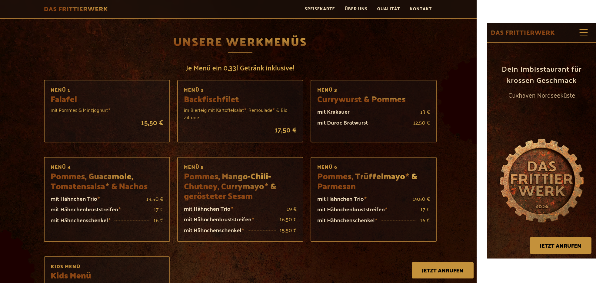

# Das Frittierwerk

**Dein Imbisstaurant für krossen Geschmack** an der Wurster Nordseeküste.

Krosses Hähnchen, knusprige Pommes, Fisch, Wurst und mehr — frisch zubereitet zum Abholen. Diese Website ist vollständig Open Source und wird automatisch über GitHub Pages bereitgestellt.

> **Feuerweg 1, 27639 Wurster Nordseeküste** · Tel. [04741 9818661](tel:04741981866) · Di–Sa 11:30–14:30 & 16:30–20:00

<p align="center">
  
</p>

---

## Auf einen Blick

| | |
|---|---|
| **Speisekarte** | Werkmenüs & Einzelgerichte mit Preisen |
| **Kontakt** | Telefon, Öffnungszeiten, Anfahrt mit Kartenansicht |
| **Über uns & Qualität** | Unser Anspruch an frische Zutaten |
| **Galerie** | Bilder rund ums Frittierwerk |
| **Open Source** | Quellcode öffentlich, MIT-Lizenz |

---

## Inhalte bearbeiten

Alle Texte, Preise und Öffnungszeiten werden über einfache Textdateien verwaltet. Dafür wird **kein** Programmierwissen benötigt — die Dateien können direkt hier auf GitHub bearbeitet werden. Nach dem Speichern wird die Seite automatisch neu gebaut und veröffentlicht.

### So funktioniert es

> **Voraussetzung:** Ein kostenloser [GitHub-Account](https://github.com/signup) mit Schreibzugriff auf dieses Repository. Wer noch keinen Account hat, kann sich in wenigen Minuten registrieren.

1. Die gewünschte Datei in der Tabelle unten anklicken
2. Oben rechts auf den **Stift** (Edit) klicken
3. Änderungen vornehmen
4. Unten auf **Commit changes** klicken — fertig!

### Inhaltsdateien

| Was | Datei | Format |
|-----|-------|--------|
| Werkmenüs (Menü 1–6, Kids) | [`src/content/werkmenus.yml`](src/content/werkmenus.yml) | YAML |
| Speisekarte (Einzelgerichte) | [`src/content/menu.yml`](src/content/menu.yml) | YAML |
| Kontakt & Öffnungszeiten | [`src/content/contact.yml`](src/content/contact.yml) | YAML |
| Galerie | [`src/content/gallery.yml`](src/content/gallery.yml) | YAML |
| Seitenname, Navigation, Footer | [`src/content/site.yml`](src/content/site.yml) | YAML |
| Über uns | [`src/content/about.md`](src/content/about.md) | Markdown |
| Qualität | [`src/content/quality.md`](src/content/quality.md) | Markdown |
| Datenschutzerklärung | [`src/content/datenschutz.md`](src/content/datenschutz.md) | Markdown |
| Impressum | [`src/content/impressum.md`](src/content/impressum.md) | Markdown |

### Beispiel: Preis ändern

In [`src/content/menu.yml`](src/content/menu.yml) steht z. B.:

```yaml
- name: "Hähnchen Trio*"
  description: "Bruststreifen, Schenkel o. Knochen & Keule"
  price: 8.50
```

Einfach `8.50` durch den neuen Preis ersetzen, speichern — die Seite aktualisiert sich automatisch.

### Beispiel: Öffnungszeiten ändern

In [`src/content/contact.yml`](src/content/contact.yml):

```yaml
hours:
  - label: "Dienstag – Samstag"
    times: "11:30 – 14:30 & 16:30 – 20:00"
  - label: "Sonntag & Montag"
    times: "Ruhetage"

hours_short: "Di–Sa 11:30–14:30 & 16:30–20:00 | So & Mo Ruhetage"
```

> **Wichtig:** Sowohl `hours` (für die Kontaktseite) als auch `hours_short` (für den Footer) aktualisieren!

### Beispiel: Galeriebilder hinzufügen

1. Bild in den Ordner [`src/assets/gallery/`](src/assets/gallery/) hochladen
2. In [`src/content/gallery.yml`](src/content/gallery.yml) einen Eintrag hinzufügen:

```yaml
images:
  - src: /assets/gallery/mein-neues-bild.jpg
    alt: "Beschreibung des Bildes"
    caption: "Optionale Bildunterschrift"
```

### Hinweis zum Stern ★

In der Speisekarte steht `*` hinter hausgemachten Spezialitäten (z. B. `Hähnchen Trio*`). Auf der Website wird das `*` automatisch als goldener Stern ★ dargestellt.

---

## Technik

### Tech Stack

| Bereich | Technologie |
|---------|-------------|
| Build | [Vite](https://vitejs.dev/) |
| UI-Framework | [Riba.js](https://github.com/ribajs/riba) (Web Components + Datenbindung) |
| Styling | [Bootstrap 5](https://getbootstrap.com/) (SCSS) mit eigenem Corporate Design |
| Templates | [Pug](https://pugjs.org/) |
| Sprache | TypeScript |
| Schriftarten | [Fontsource](https://fontsource.org/) (Palanquin) |
| Inhalte | YAML + Markdown, zur Build-Zeit verarbeitet |
| Hosting | GitHub Pages (automatisches Deployment) |
| Paketmanager | Yarn 4 |

### Projektstruktur

```
das-frittier-werk/
├── src/
│   ├── assets/            # Bilder, Favicons, SVGs
│   │   ├── gallery/       # Galerie-Bilder
│   │   ├── gears/         # Zahnrad-SVGs (Hintergrund)
│   │   └── favicon/       # Favicons & App-Icons
│   ├── content/           # Inhalte (YAML + Markdown)
│   │   ├── werkmenus.yml  # Werkmenüs (Menü 1–6)
│   │   ├── menu.yml       # Speisekarte (Einzelgerichte)
│   │   ├── contact.yml    # Kontakt & Öffnungszeiten
│   │   ├── gallery.yml    # Galerie-Konfiguration
│   │   ├── site.yml       # Seitenname, Navigation, Footer
│   │   ├── about.md       # Über uns
│   │   ├── quality.md     # Qualität
│   │   ├── datenschutz.md # Datenschutzerklärung
│   │   └── impressum.md   # Impressum
│   ├── scss/              # Stylesheets (Bootstrap + Custom)
│   ├── ts/                # TypeScript-Quellcode
│   │   ├── components/    # Web Components (Gallery, Map, etc.)
│   │   ├── binders/       # Riba.js Binder (Scroll-Rotation, etc.)
│   │   ├── utils/         # Hilfsfunktionen
│   │   └── types/         # TypeScript-Typdefinitionen
│   ├── views/             # Pug-Templates
│   │   ├── layouts/       # Seitenlayout
│   │   ├── pages/         # Seitenvorlagen
│   │   └── partials/      # Wiederverwendbare Bausteine
│   └── public/            # Statische Dateien (werden 1:1 kopiert)
├── scripts/               # Build-Skripte
├── .github/workflows/     # GitHub Actions (CI/CD)
├── vite.config.js         # Vite-Konfiguration
├── vite-plugin-pug-pages.js   # Custom Plugin: Pug → HTML
├── vite-plugin-manifest.js    # Custom Plugin: PWA-Manifest
└── package.json
```

### Voraussetzungen

- Node.js ≥ 24
- Yarn 4

### Installation & Entwicklung

```bash
# Abhängigkeiten installieren
yarn install

# Entwicklungsserver starten (Watch + Preview)
yarn start
```

Die Seite ist dann unter `http://localhost:4173` erreichbar.

### Verfügbare Skripte

| Befehl | Beschreibung |
|--------|-------------|
| `yarn start` | Entwicklungsserver mit Live-Reload |
| `yarn watch` | Dateiänderungen beobachten & neu bauen |
| `yarn hmr` | Vite Dev-Server mit Hot Module Replacement |
| `yarn preview` | Produktions-Build lokal anzeigen |
| `yarn build` | Produktions-Build erstellen (Ausgabe: `_site/`) |
| `yarn build:dev` | Entwicklungs-Build erstellen |
| `yarn check` | TypeScript-Typprüfung |
| `yarn clear` | Build-Verzeichnis löschen (`_site/`) |

### Deployment

Die Seite wird automatisch über **GitHub Actions** auf **GitHub Pages** deployed. Bei jedem Push auf `main` wird gebaut und veröffentlicht.

Ein manuelles Deployment ist über **Actions → Deploy GitHub Page → Run workflow** möglich.

### Custom Vite Plugins

| Plugin | Beschreibung |
|--------|-------------|
| `vite-plugin-pug-pages.js` | Kompiliert Pug-Templates zu HTML, lädt YAML/Markdown-Inhalte und registriert sie als Multi-Page-Einträge |
| `vite-plugin-manifest.js` | Generiert das PWA-Manifest (`site.webmanifest`) aus `site.yml` |

---

## Lizenz

MIT — siehe [LICENSE](LICENSE).

## Autoren

**[Art+Code Studio](https://artandcode.studio)**

- **Pascal Garber** · Entwicklung
- **Maya Philine Henze** · Design
